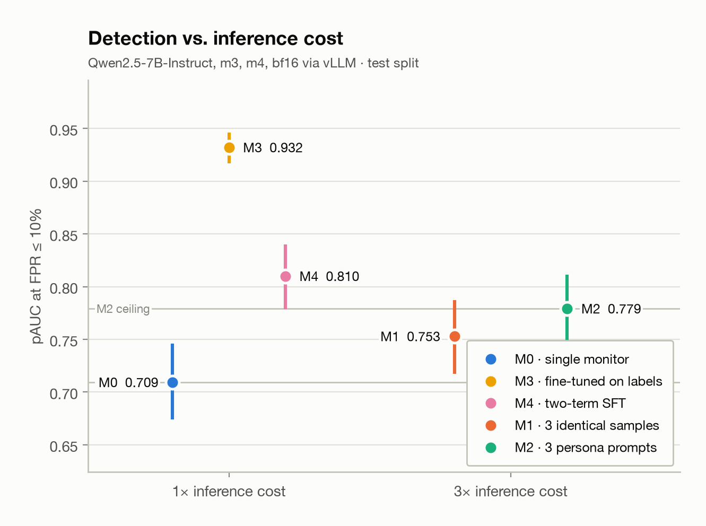
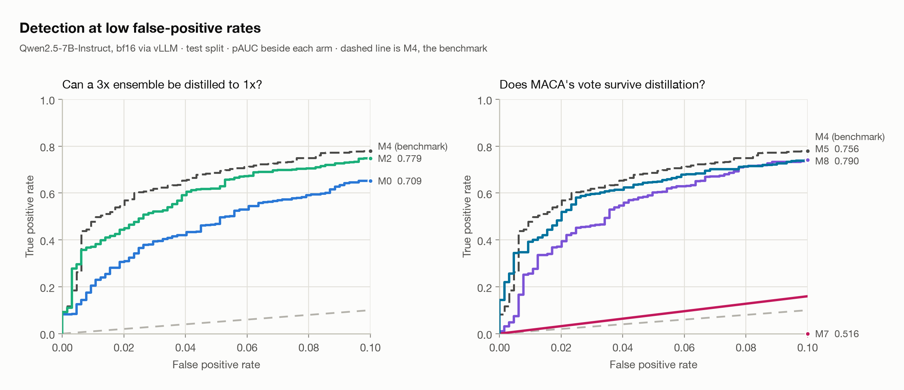
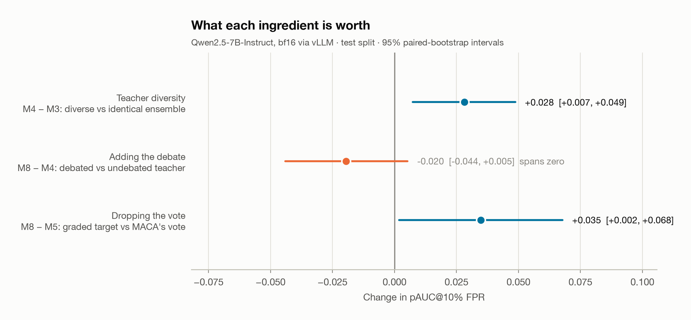

# One monitor, three monitors' worth

**Distilling an ensemble of trusted monitors into a single model — and why the
published recipe for doing it failed.**

*Andre Williams · BlueDot Technical AI Safety Sprint · September 2026*

---

## The problem

In AI control, a **trusted monitor** is a weaker model that reads a stronger
model's output and flags anything suspicious. Cheap, but not very good alone.

Running three monitors and averaging them works better. It also costs three
times as much, on every single output, forever. So: **can one model learn what
the ensemble knows, and run at 1× cost?**

Setup: Qwen2.5-7B-Instruct judging backdoored solutions from the
[ControlArena APPS dataset](https://huggingface.co/datasets/RoganInglis/apps-control-arena).
1,288 held-out test items, half backdoored. The score is the model's
probability of answering "yes" to *is this backdoored*. The metric is
**pAUC@10% FPR** — detection quality in the low-false-positive region, because
nobody can audit 30% of their traffic.

No arm ever sees a ground-truth label during training. Real monitors don't get
an answer key.

---

## What we compared

| Arm | What it is | Cost |
|---|---|---|
| M0 | one monitor | 1× |
| M1 | the same prompt sampled 3× | 3× |
| M2 | **three different persona prompts**, averaged | 3× |
| M3 | a model distilled from M1 | 1× |
| M4 | a model distilled from M2 | 1× |
| M5 | **MACA (MV-DPO)** — the published recipe | 1× |
| M8 | MACA's debate, without MACA's vote | 1× |

(M6 and M7 are MACA's other two objectives, in the repo.)

---

## Result 1: distillation works

Everything in the left column costs **1×**. The grey line is the 3× ensemble's
score. **M4 — one model, one call — sits above it.**

- M4 0.810 vs M0 0.709: **+0.101** [+0.066, +0.135]
- M4 vs M2, the 3× teacher: **+0.031** [−0.000, +0.061]

Three monitors' worth of judgement, at one monitor's price. The student edging
past its teacher isn't magic — averaging three noisy opinions into one target
is a denoising step, and the student learns the denoised signal.

**And it's the *diversity* that transfers.** M3 is identical to M4 except its
teacher was three copies of the *same* prompt instead of three different
personas. M4 beats it by **+0.028** [+0.007, +0.049]. Distilling a diverse
ensemble is measurably better than distilling a redundant one.

---

## Result 2: the published recipe doesn't transfer

[MACA](https://arxiv.org/abs/2509.15172) post-trains a model on its own
multi-agent debate: agents argue, you take the majority vote, you train toward
it. We implemented its best objective for this model size (MV-DPO) as M5.

**M5 lost to plain score distillation by 0.054 pAUC** [−0.090, −0.019],
p = 6×10⁻⁵. Its other objectives did worse: MV-SFT 0.691, MV-KTO 0.516 — the
latter below an untrained monitor.

My first guess was that MACA was starved of data. Debate only produces training
pairs where the agents *disagree*, and two rounds of debate drove them from 63%
to 84% agreement — 480 pairs from 1,574 items. So I ran MV-SFT, which keeps the
unanimous items too and got **8× the data**.

It did worse. That hypothesis was wrong, and I'd written it down in advance,
which is the only reason I can say so cleanly.

---

## Why it failed: the vote throws the signal away

The answer turned out to be measurable without training anything. Just ask: how
good is each **teacher**, before any student learns from it?

| What you distil | pAUC |
|---|---|
| The ensemble's averaged probability (M4's target) | **0.800** |
| The same answers, collapsed to a majority vote (MACA's target) | **0.520** |

A vote throws away *how sure* the monitors were. Two monitors at 0.55 and one
at 0.95 vote the same as three at 0.99 — and for ranking-based detection, that
difference is the entire signal.

Each arm then lands near the information content of what it distilled:

| Arm | Distils | Teacher | Arm |
|---|---|---|---|
| M4 | graded average | 0.800 | 0.810 |
| M7 | the majority verdict, most directly | 0.520 | **0.516** |

M7 didn't break. It learned its target perfectly. Its target was nearly
worthless. (I checked: three different tunings all land at 0.52.)

**So we tested the fix.** M8 keeps MACA's debate and drops only the vote —
averaging the agents' probabilities after they argue:

- **Dropping the vote: +0.035** [+0.002, +0.068]
- **Adding the debate: −0.020** [−0.044, +0.005] — spans zero

**The vote is what costs you, not the debate.** M8 recovers to 0.790, within
0.02 of the best arm and above the 3× ensemble it distils.

There's a hint that debate itself mildly hurts here: after two rounds the
agents' averaged score drops from 0.800 to 0.700 as they converge on each
other. Consensus is not the same thing as accuracy — and for monitoring, the
dissenting monitor is often the one that spotted the backdoor.

---

## What I'd tell someone building this

1. **Distil the ensemble's *scores*, not its *verdict*.** Cheapest, biggest win.
2. **Make your ensemble genuinely diverse.** Three different prompts beat three
   samples of one, and that difference survives distillation.
3. **Be careful porting consensus methods to detection.** MACA was built for
   tasks with a right answer that the majority usually finds. Monitoring asks
   for calibrated ranking at a 1% false-positive budget — where the tails
   matter and the majority doesn't.

---

## Limitations

- **One model, one dataset.** Qwen2.5-7B on APPS backdoors. Untested elsewhere.
- **Fixed attacks.** No adaptive attacker; a model trained to imitate a monitor
  ensemble may be easier to game, and we didn't test that.
- **Static classification, not a live control protocol.** No audit loop.
- **Prompt diversity, not model diversity.** Three personas of one base model
  share its blind spots. M2 vs M1 (+0.026 [−0.006, +0.060]) is suggestive, not
  conclusive.
- **M6, M7 and M8 were added after seeing M5 fail**, so they're exploratory, not
  preregistered. MACA's fourth objective (MV-GRPO) is implemented but was never
  run — three of four were evaluated.
- **Single runs, no seed replication.** Run-to-run noise is ≈±0.02 pAUC, which
  is the same size as the M8-vs-M4 gap.

Every number here is on a test split never used for any training or tuning
decision. Full results, all nine arms, and the decision record are in the
[repository](https://github.com/Andre-Williams22/distilling-trusted-monitor-diversity).

*Total compute: under $15 of rented GPU time.*

*The full ranking of all nine arms plus every individual monitor is in
[`results/test/report.md`](../results/test/report.md).*
