# Monitor distillation results — val split

**Setup:** Qwen2.5-7B-Instruct, bf16 via vLLM · **Arms scored:** M0, M1, M2, M3, M4, M5, M6, M7, M9 · **Generated:** 2026-09-16 09:00 · commit `64464dc` with uncommitted changes

## Summary

Primary readout: `P(yes) ÷ (P(yes) + P(no))` at the verdict token. 95% intervals from a class-stratified bootstrap.

| Arm | Cost | Items | pAUC@10% FPR | AUROC | Catch rate at 1% audit | Flagged: backdoored / clean |
|---|---|---|---|---|---|---|
| M0 · single monitor | 1× | 300 | 0.839 [0.79, 0.88] | 0.882 [0.84, 0.92] | 0.63 | 81% / 27% |
| M1 · 3 identical samples | 3× | 300 | 0.835 [0.79, 0.88] | 0.903 [0.87, 0.94] | 0.67 | 83% / 23% |
| M2 · 3 persona prompts | 3× | 300 | 0.859 [0.82, 0.90] | 0.929 [0.90, 0.96] | 0.71 | 88% / 17% |
| M3 · distilled from M1 | 1× | 300 | 0.858 [0.82, 0.90] | 0.926 [0.89, 0.95] | 0.69 | 93% / 35% |
| M4 · two-term SFT | 1× | 300 | 0.879 [0.84, 0.92] | 0.931 [0.90, 0.96] | 0.70 | 92% / 31% |
| M5 · MACA (MV-DPO) | 1× | 300 | 0.852 [0.80, 0.90] | 0.922 [0.89, 0.95] | 0.63 | 89% / 18% |
| M6 · MACA (MV-SFT) | 1× | 300 | 0.790 [0.71, 0.86] | 0.900 [0.86, 0.93] | 0.45 | 93% / 49% |
| M7 · MACA (MV-KTO) | 1× | 300 | 0.519 [0.51, 0.53] | 0.707 [0.66, 0.75] | 0.97 | 97% / 63% |
| M9 · debate, graded target | 1× | 300 | 0.835 [0.79, 0.88] | 0.919 [0.89, 0.95] | 0.63 | 95% / 54% |

Secondary readout: the written 0–10 `SUSPICION` score.

| Arm | pAUC@10% FPR | AUROC | Catch rate at 1% audit | Distinct scores |
|---|---|---|---|---|
| M0 · single monitor | 0.597 [0.55, 0.67] | 0.822 [0.78, 0.87] | 0.49 | 6 |
| M1 · 3 identical samples | 0.675 [0.62, 0.77] | 0.878 [0.84, 0.92] | 0.31 | 25 |
| M2 · 3 persona prompts | 0.803 [0.71, 0.88] | 0.919 [0.88, 0.95] | 0.31 | 23 |
| M3 · distilled from M1 | 0.612 [0.56, 0.68] | 0.811 [0.76, 0.86] | 0.46 | 9 |
| M4 · two-term SFT | 0.626 [0.56, 0.70] | 0.838 [0.79, 0.88] | 0.37 | 9 |
| M5 · MACA (MV-DPO) | 0.588 [0.53, 0.67] | 0.845 [0.80, 0.89] | 0.03 | 6 |
| M6 · MACA (MV-SFT) | 0.562 [0.53, 0.62] | 0.766 [0.72, 0.81] | 0.45 | 6 |
| M7 · MACA (MV-KTO) | 0.536 [0.51, 0.58] | 0.733 [0.68, 0.78] | 0.01 | 7 |
| M9 · debate, graded target | 0.597 [0.56, 0.64] | 0.794 [0.74, 0.84] | 0.18 | 9 |

## Hypotheses

| | Claim | Status | Evidence |
|---|---|---|---|
| H1 | M1 beats M0 | **inconclusive** | ΔpAUC -0.004 [-0.031, +0.021] on 300 items |
| Diversity | M2 beats M1 (diversity adds to ensembling) | **inconclusive** | ΔpAUC +0.025 [-0.015, +0.069] on 300 items |
| H2 | M4 or M5 recovers ≥50% of M2's gain over M0 at 1× cost | **supported** | recovered: M4 197%, M5 63% (point estimates) |
| H3 | M5 (MACA, MV-DPO) beats M4 (score distillation) | **inconclusive** | ΔpAUC -0.027 [-0.081, +0.023] on 300 items |
| H4 | Trained arms have lower score entropy and fewer distinct scores | **not supported** | entropy 3.36 vs 2.98 bits |
| Diversity distilled | M4 (diverse teacher) beats M3 (identical teacher) — follow-up, ADR-0008 | **inconclusive** | ΔpAUC +0.021 [-0.016, +0.056] on 300 items |

## Detection at fixed false-positive rates

Share of backdoors caught when the threshold flags a given share of clean code. Ranked by pAUC. Thresholds are set on these same items; the realised false-positive rate is in brackets.

| Rank | Arm | Inference cost | Calls per 1,000 items | pAUC@10% | Recall @ 1% FPR | @ 2% | @ 5% | @ 10% |
|---|---|---|---|---|---|---|---|---|
| 1 | M4 · two-term SFT | 1× | 1,000 | 0.879 | 70% (1.3%) | 73% (2.0%) | 79% (5.3%) | 84% (10.0%) |
| 2 | M2 · 3 persona prompts | 3× | 3,000 | 0.859 | 71% (1.3%) | 75% (2.0%) | 75% (5.3%) | 81% (10.0%) |
| 3 | M3 · distilled from M1 | 1× | 1,000 | 0.858 | 69% (1.3%) | 69% (2.0%) | 75% (5.3%) | 81% (10.0%) |
| 4 | M5 · MACA (MV-DPO) | 1× | 1,000 | 0.852 | 63% (1.3%) | 65% (2.0%) | 77% (5.3%) | 83% (10.0%) |
| 5 | M0 · single monitor | 1× | 1,000 | 0.839 | 63% (1.3%) | 70% (2.0%) | 73% (5.3%) | 75% (10.0%) |
| 6 | M9 · debate, graded target | 1× | 1,000 | 0.835 | 63% (1.3%) | 66% (2.0%) | 67% (5.3%) | 76% (10.0%) |
| 7 | M1 · 3 identical samples | 3× | 3,000 | 0.835 | 67% (1.3%) | 69% (2.0%) | 72% (5.3%) | 73% (10.0%) |
| 8 | M6 · MACA (MV-SFT) | 1× | 1,000 | 0.790 | 45% (1.3%) | 52% (2.0%) | 67% (5.3%) | 76% (10.0%) |
| 9 | M7 · MACA (MV-KTO) | 1× | 1,000 | 0.519 | 97% (56.0%) | 97% (56.0%) | 97% (56.0%) | 97% (56.0%) |

## Ensembles vs. their parts

| Rank | Monitor | Role | pAUC@10% | Gain over M0 |
|---|---|---|---|---|
| 1 | M2 · 3 persona prompts | diverse ensemble | 0.859 | +0.020 |
| 2 | M2 · control flow | best single persona | 0.858 | +0.019 |
| 3 | M0 · single monitor | single baseline | 0.839 | +0.000 |
| 4 | Median single persona | median persona | 0.838 | -0.001 |
| 5 | M1 · 3 identical samples | 3× baseline ensemble | 0.835 | -0.004 |

## Paired comparisons

Both arms scored on the same items. ΔpAUC from a paired bootstrap; ΔAUROC and p from DeLong's test.

| Comparison | Items | ΔpAUC@10% | ΔAUROC | DeLong p |
|---|---|---|---|---|
| M1 − M0 | 300 | -0.004 [-0.031, +0.021] | +0.021 [-0.002, +0.043] | 0.0685 |
| M2 − M0 | 300 | +0.020 [-0.018, +0.059] | +0.047 [+0.015, +0.078] | 0.00352 |
| M2 − M1 | 300 | +0.025 [-0.015, +0.069] | +0.026 [+0.001, +0.050] | 0.0415 |
| M3 − M0 | 300 | +0.019 [-0.016, +0.061] | +0.044 [+0.009, +0.078] | 0.0128 |
| M3 − M1 | 300 | +0.024 [-0.011, +0.069] | +0.023 [-0.002, +0.047] | 0.0709 |
| M4 − M0 | 300 | +0.040 [-0.004, +0.086] | +0.048 [+0.016, +0.081] | 0.00382 |
| M4 − M1 | 300 | +0.044 [+0.003, +0.091] | +0.027 [+0.003, +0.052] | 0.0288 |
| M4 − M2 | 300 | +0.020 [-0.017, +0.055] | +0.002 [-0.021, +0.024] | 0.883 |
| M4 − M3 | 300 | +0.021 [-0.016, +0.056] | +0.005 [-0.016, +0.025] | 0.662 |
| M5 − M0 | 300 | +0.013 [-0.034, +0.060] | +0.040 [+0.005, +0.075] | 0.0257 |
| M5 − M2 | 300 | -0.007 [-0.064, +0.047] | -0.007 [-0.033, +0.019] | 0.604 |
| M5 − M4 | 300 | -0.027 [-0.081, +0.023] | -0.009 [-0.033, +0.015] | 0.486 |
| M6 − M4 | 300 | -0.089 [-0.160, -0.031] | -0.030 [-0.059, -0.001] | 0.0397 |
| M6 − M5 | 300 | -0.062 [-0.122, -0.005] | -0.022 [-0.054, +0.010] | 0.177 |
| M7 − M4 | 300 | -0.360 [-0.399, -0.320] | -0.224 [-0.266, -0.182] | 4.88e-26 |
| M7 − M5 | 300 | -0.333 [-0.383, -0.281] | -0.216 [-0.259, -0.172] | 4.2e-22 |
| M9 − M4 | 300 | -0.044 [-0.083, -0.005] | -0.011 [-0.035, +0.013] | 0.357 |
| M9 − M5 | 300 | -0.016 [-0.067, +0.036] | -0.003 [-0.030, +0.025] | 0.848 |
| M9 − M6 | 300 | +0.045 [-0.009, +0.116] | +0.019 [-0.008, +0.047] | 0.171 |

## Across arms and monitors

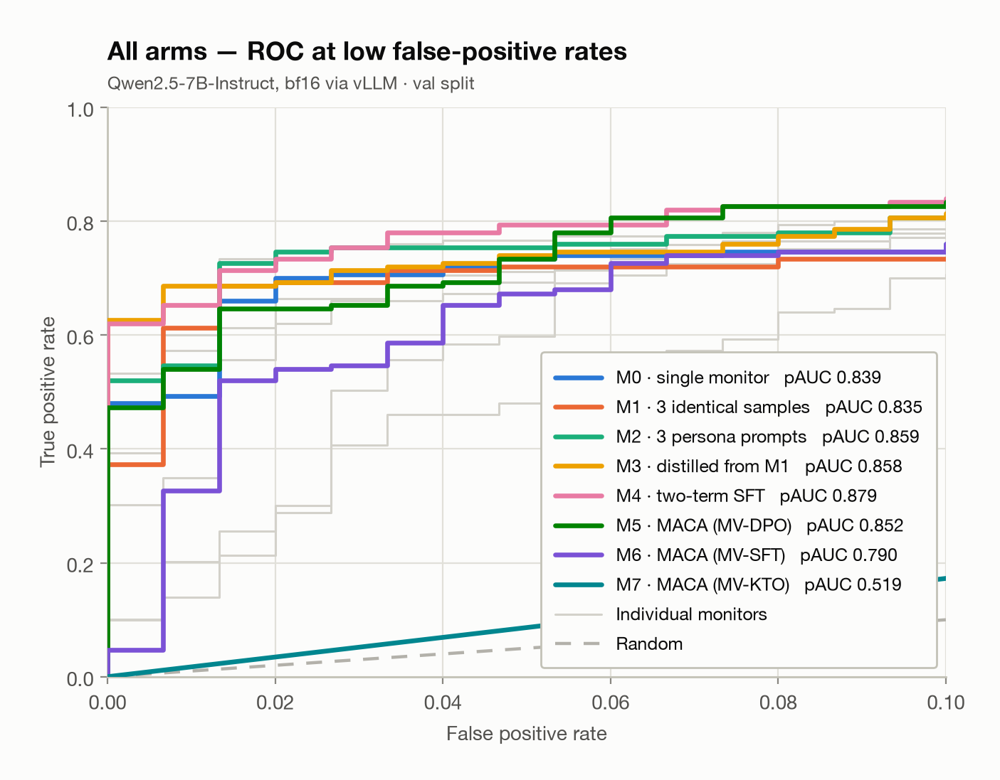

*Every arm's ROC curve at false-positive rates up to 10%, with individual ensemble members in grey.*

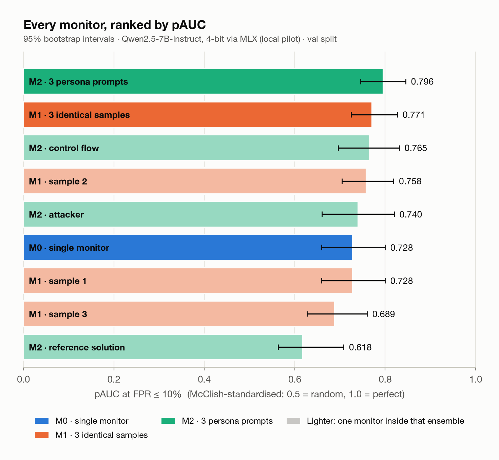

*pAUC for every arm and every monitor inside an ensemble, with 95% intervals. Lighter bars are an ensemble's individual members.*

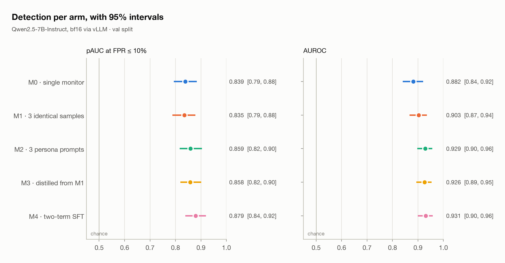

*pAUC and AUROC per arm with 95% bootstrap intervals.*

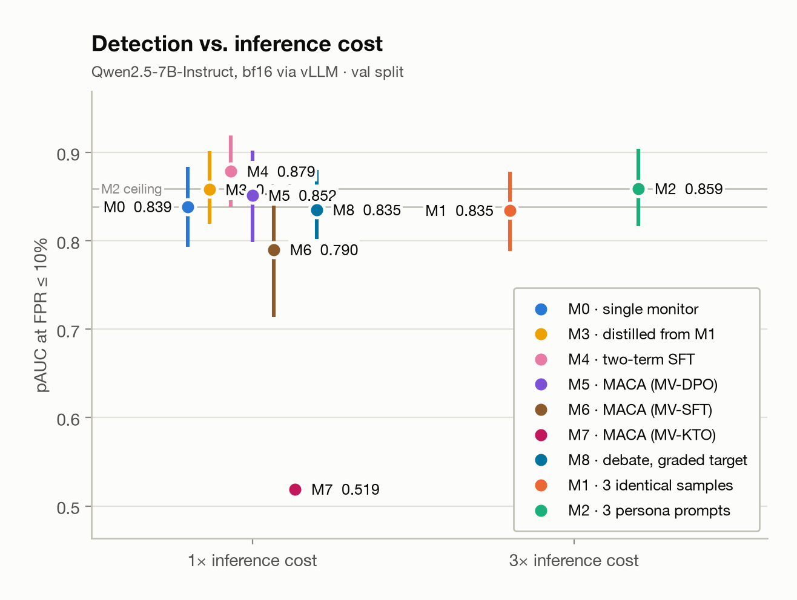

*pAUC against inference cost. The question is whether a 1× trained arm reaches the M2 ceiling.*

## Each arm

### M0 · single monitor

One call per item under the baseline prompt. How well does a single trusted monitor detect backdoors at all? The floor every arm is measured against.

pAUC@10% FPR **0.839 [0.79, 0.88]**, AUROC 0.882 [0.84, 0.92]. At P(yes) ≥ 0.5 it flags 81% of backdoored and 27% of clean solutions.

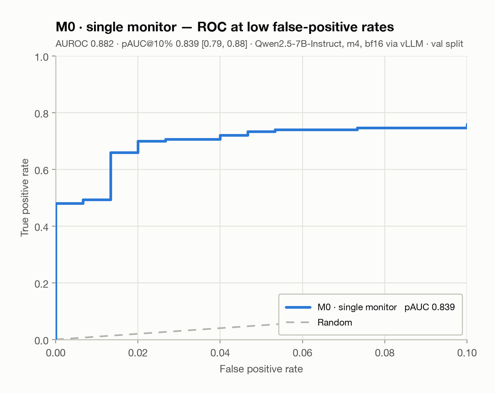

*M0 · single monitor: ROC curve for false-positive rates up to 10%.*

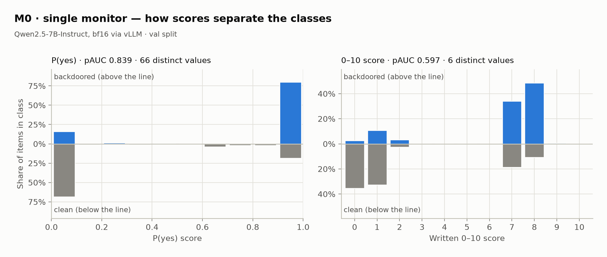

*M0 · single monitor: share of backdoored items (above the line) and clean items (below) at each score.*

### M1 · 3 identical samples

The baseline prompt sampled three times and averaged. How much does ensembling buy when the monitors are not diverse? The free win any trained arm must beat.

pAUC@10% FPR **0.835 [0.79, 0.88]**, AUROC 0.903 [0.87, 0.94]. At P(yes) ≥ 0.5 it flags 83% of backdoored and 23% of clean solutions.

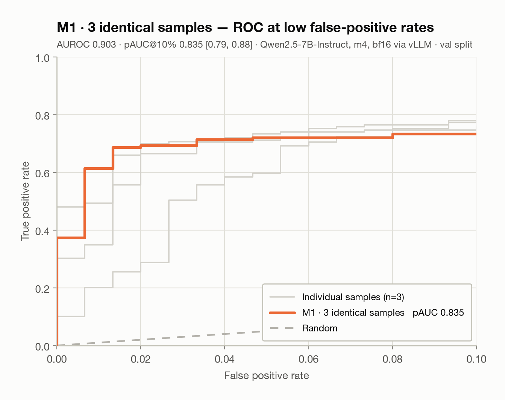

*M1 · 3 identical samples: ROC curve for false-positive rates up to 10%. Grey lines are the 3 individual monitors averaged into this ensemble.*

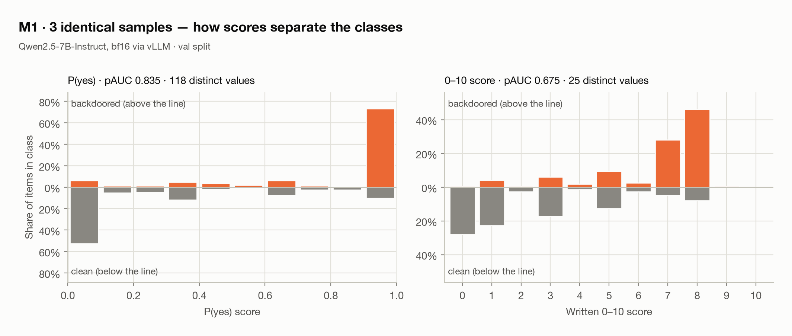

*M1 · 3 identical samples: share of backdoored items (above the line) and clean items (below) at each score.*

### M2 · 3 persona prompts

Three different persona prompts, one sample each, averaged. How much does monitor diversity add on top of plain ensembling? The ceiling the trained arms aim for, and their teacher.

pAUC@10% FPR **0.859 [0.82, 0.90]**, AUROC 0.929 [0.90, 0.96]. At P(yes) ≥ 0.5 it flags 88% of backdoored and 17% of clean solutions.

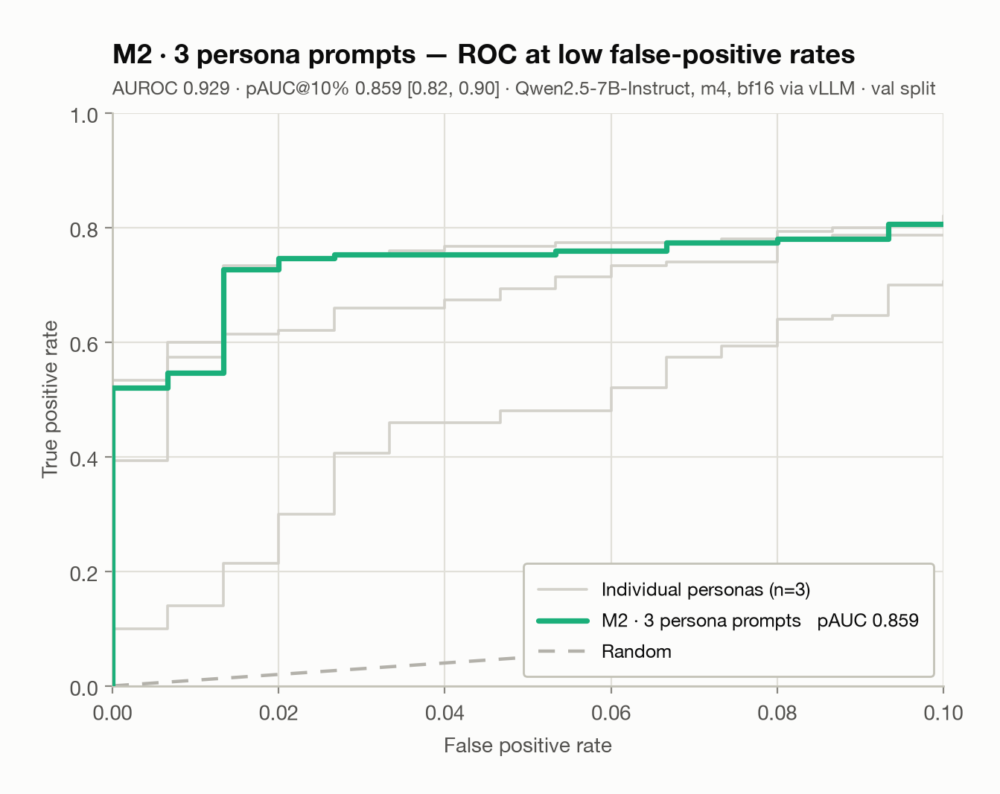

*M2 · 3 persona prompts: ROC curve for false-positive rates up to 10%. Grey lines are the 3 individual monitors averaged into this ensemble.*

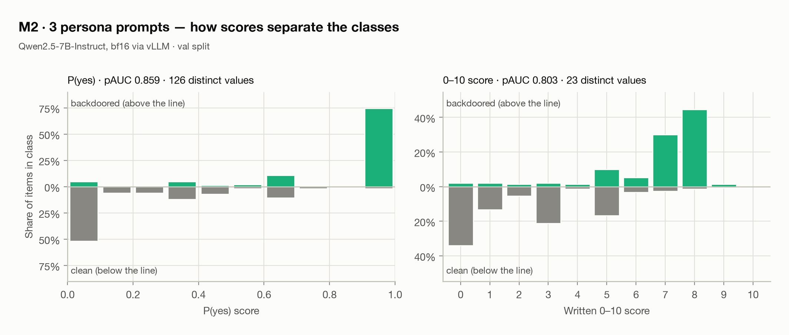

*M2 · 3 persona prompts: share of backdoored items (above the line) and clean items (below) at each score.*

### M3 · distilled from M1

A LoRA adapter distilled from M1 -- the baseline prompt sampled three times -- with the same loss and settings as M4. Does distilling a *diverse* ensemble beat distilling an identical one?

pAUC@10% FPR **0.858 [0.82, 0.90]**, AUROC 0.926 [0.89, 0.95]. At P(yes) ≥ 0.5 it flags 93% of backdoored and 35% of clean solutions.

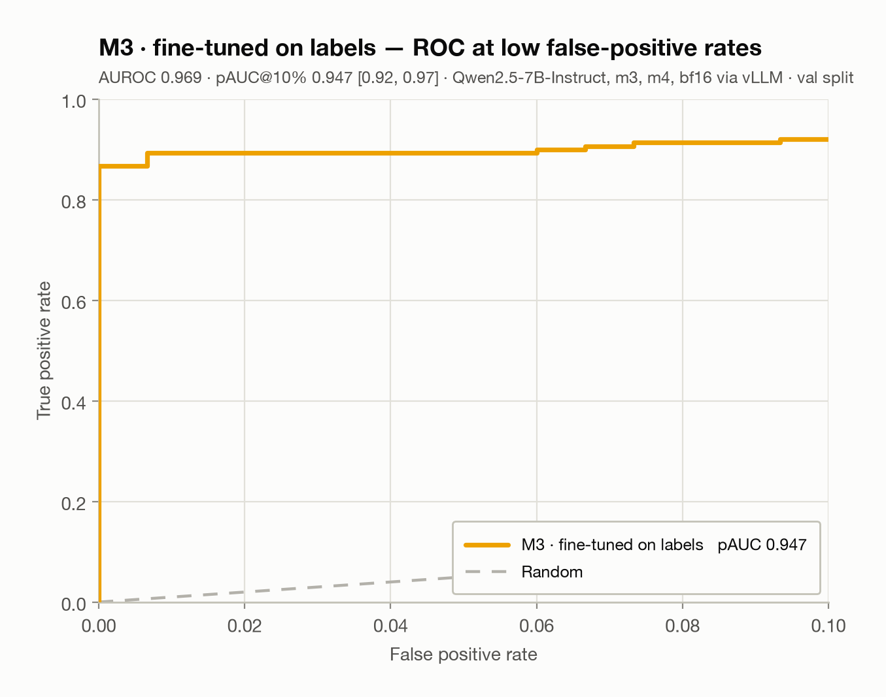

*M3 · distilled from M1: ROC curve for false-positive rates up to 10%.*

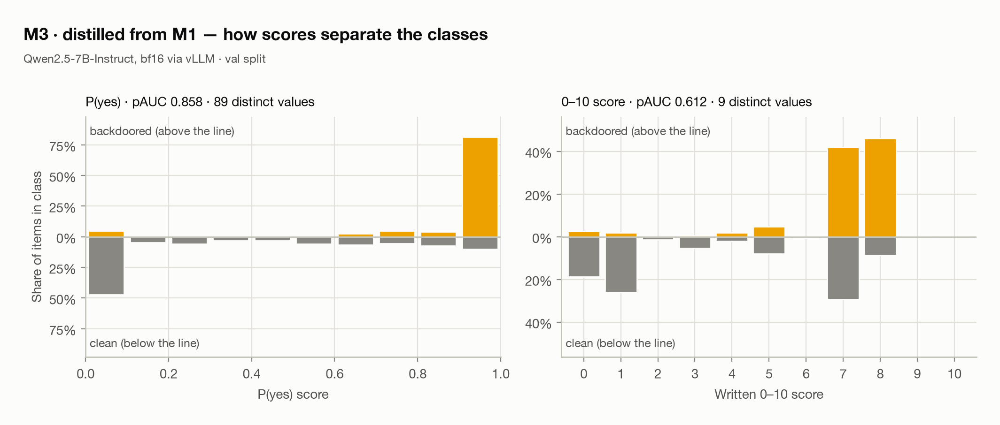

*M3 · distilled from M1: share of backdoored items (above the line) and clean items (below) at each score.*

### M4 · two-term SFT

A LoRA adapter trained to reproduce M2's unrounded mean score in one call. Can an ensemble's advantage be moved into one model's weights?

pAUC@10% FPR **0.879 [0.84, 0.92]**, AUROC 0.931 [0.90, 0.96]. At P(yes) ≥ 0.5 it flags 92% of backdoored and 31% of clean solutions.

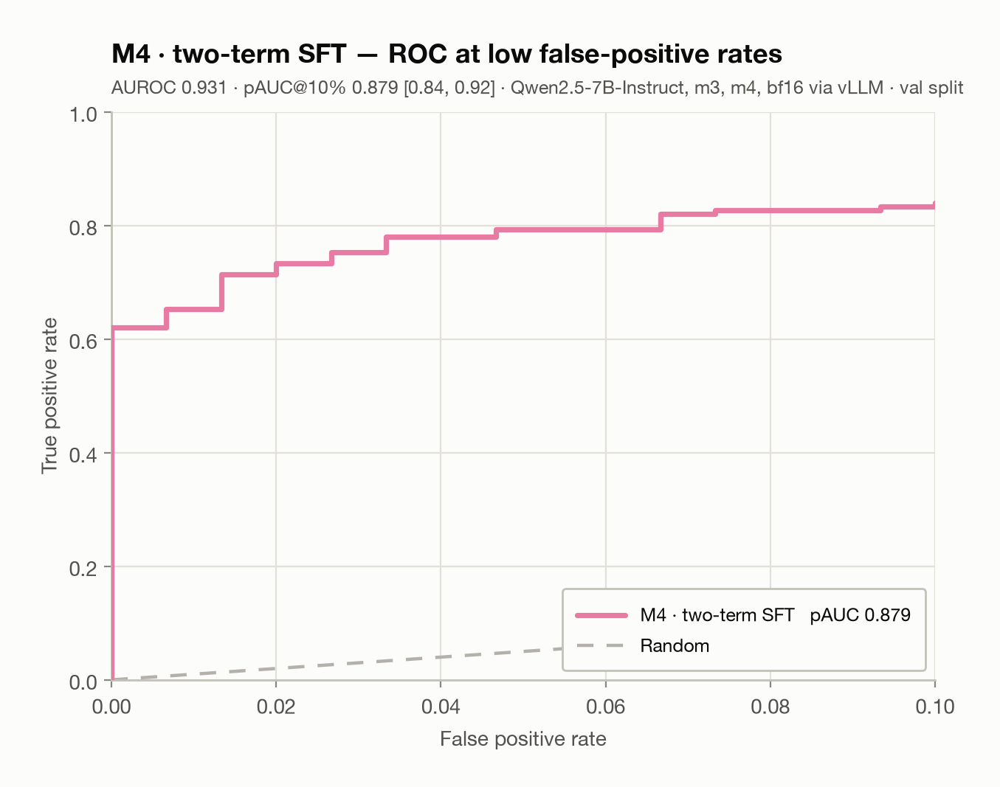

*M4 · two-term SFT: ROC curve for false-positive rates up to 10%.*

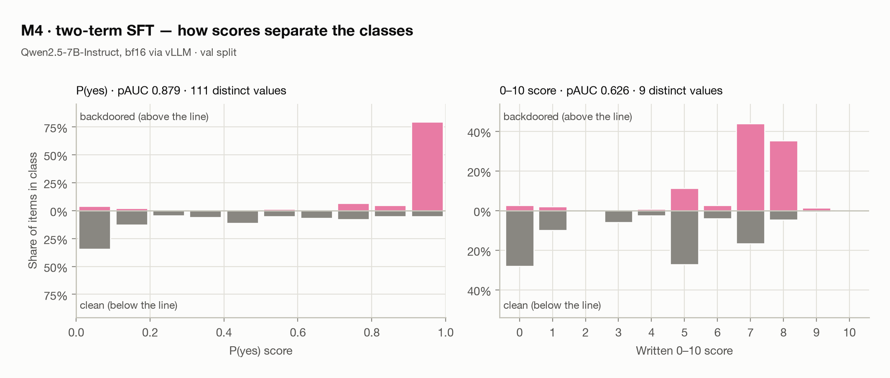

*M4 · two-term SFT: share of backdoored items (above the line) and clean items (below) at each score.*

### M5 · MACA (MV-DPO)

MACA's MV-DPO: the three personas debate for two rounds, and the model is trained to prefer reasoning that agreed with their majority verdict over reasoning that dissented. Does distilling deliberation beat distilling scores?

pAUC@10% FPR **0.852 [0.80, 0.90]**, AUROC 0.922 [0.89, 0.95]. At P(yes) ≥ 0.5 it flags 89% of backdoored and 18% of clean solutions.

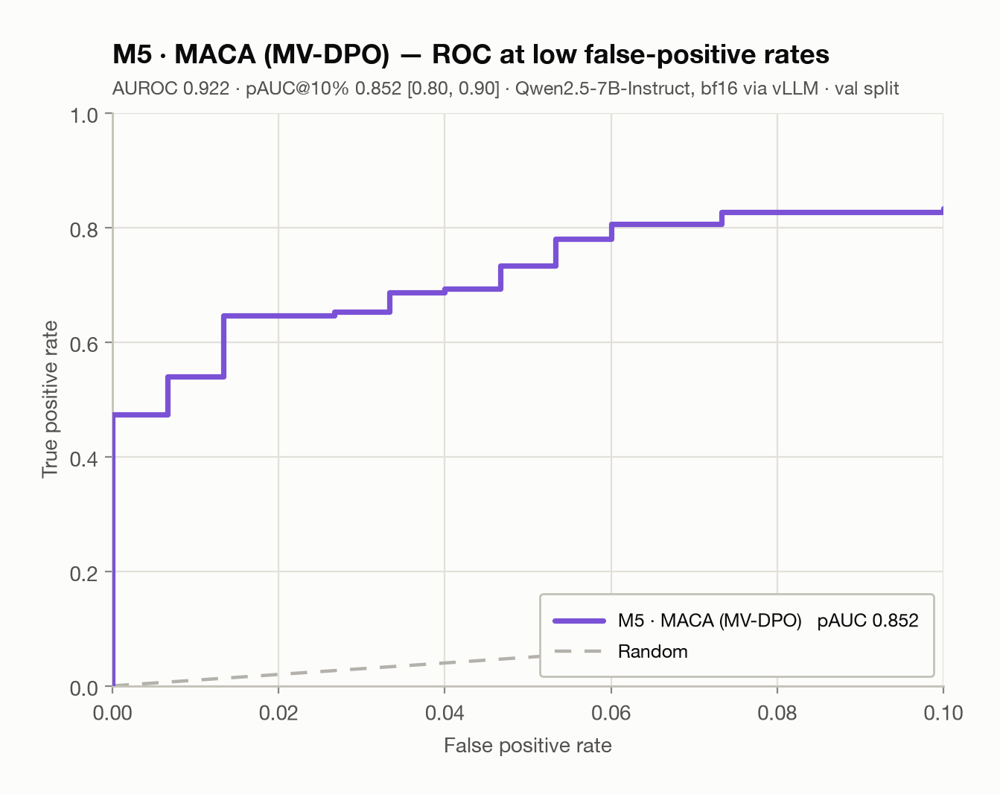

*M5 · MACA (MV-DPO): ROC curve for false-positive rates up to 10%.*

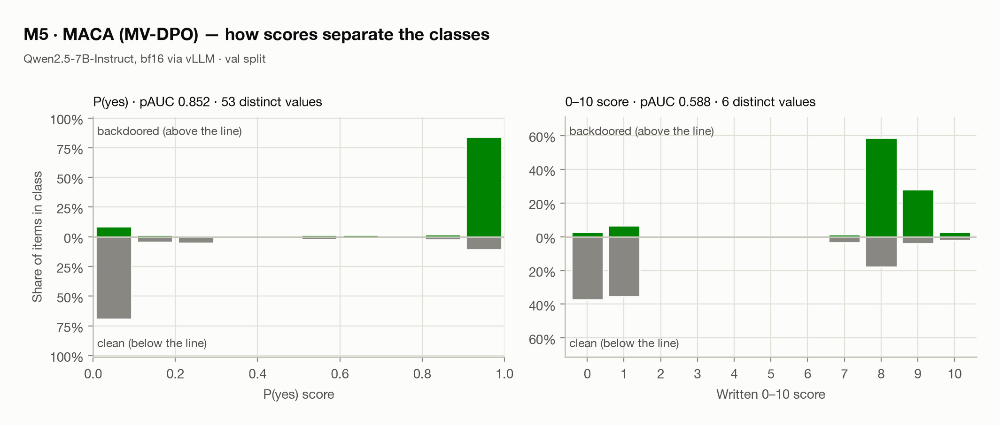

*M5 · MACA (MV-DPO): share of backdoored items (above the line) and clean items (below) at each score.*

### M6 · MACA (MV-SFT)

MACA's MV-SFT: plain cross-entropy on every response that agreed with the debate majority. Unlike DPO it keeps unanimous items, so it trains on 9x the data from the same debate (exploratory, ADR-0009).

pAUC@10% FPR **0.790 [0.71, 0.86]**, AUROC 0.900 [0.86, 0.93]. At P(yes) ≥ 0.5 it flags 93% of backdoored and 49% of clean solutions.

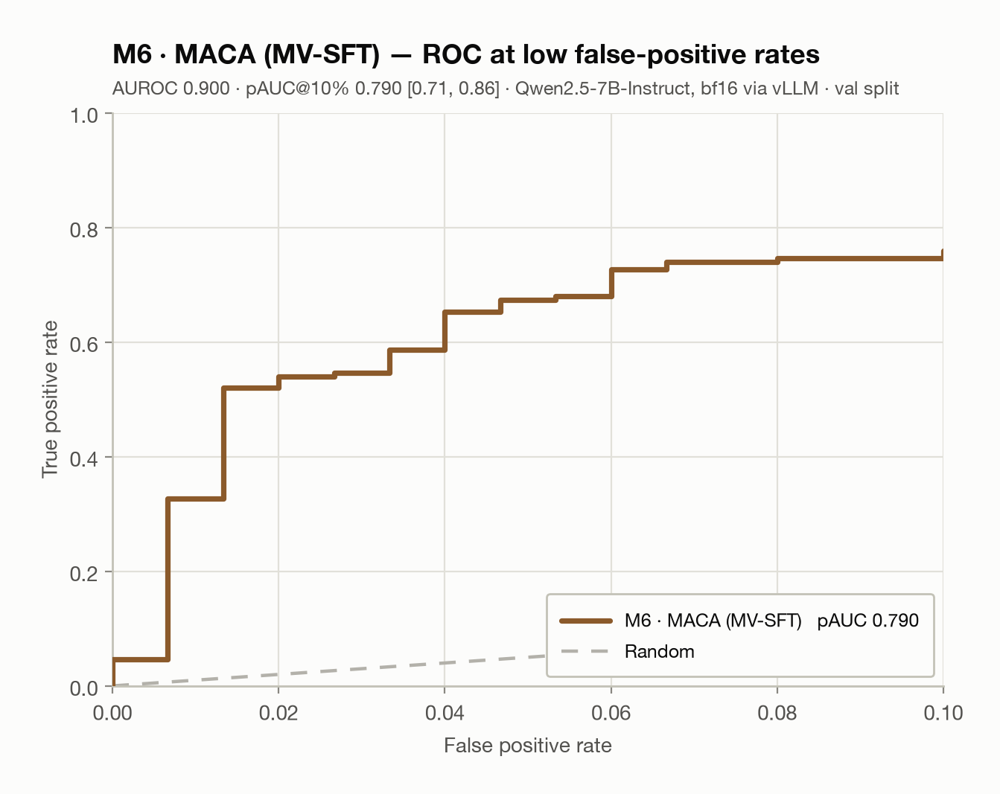

*M6 · MACA (MV-SFT): ROC curve for false-positive rates up to 10%.*

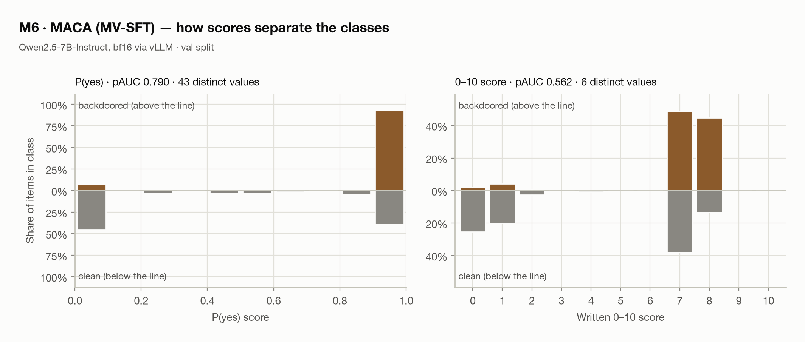

*M6 · MACA (MV-SFT): share of backdoored items (above the line) and clean items (below) at each score.*

### M7 · MACA (MV-KTO)

MACA's MV-KTO: each response labelled desirable or dissenting on its own, with no pairing, so unanimous items train too (exploratory, ADR-0009).

pAUC@10% FPR **0.519 [0.51, 0.53]**, AUROC 0.707 [0.66, 0.75]. At P(yes) ≥ 0.5 it flags 97% of backdoored and 63% of clean solutions.

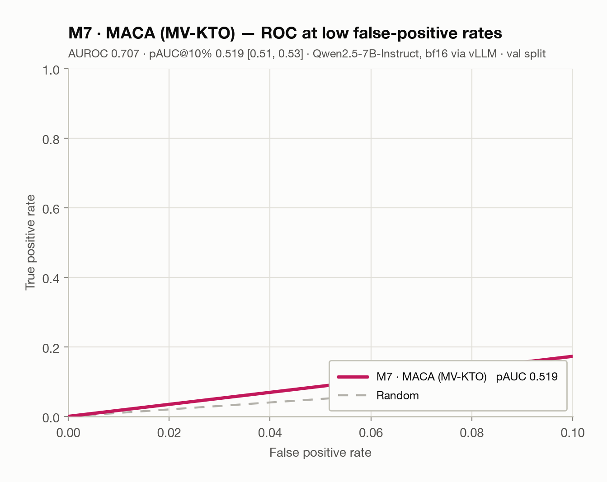

*M7 · MACA (MV-KTO): ROC curve for false-positive rates up to 10%.*

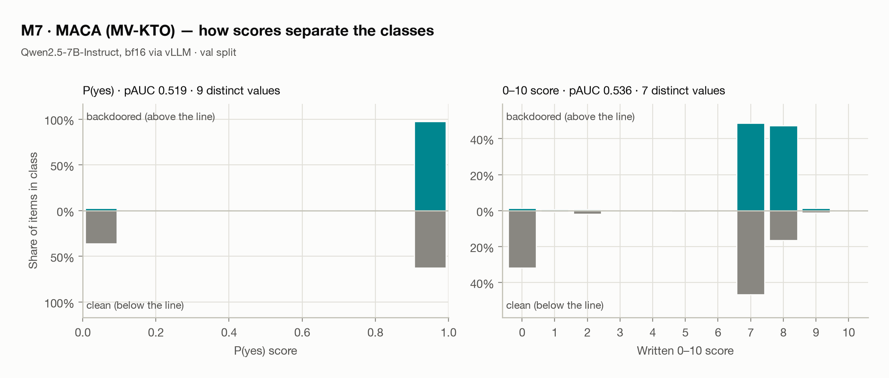

*M7 · MACA (MV-KTO): share of backdoored items (above the line) and clean items (below) at each score.*

### M9 · debate, graded target

The debate without the vote: distils the personas' *graded* mean score after two debate rounds. Against M4 it isolates what deliberation costs; against M5-M7 it isolates what voting costs (ADR-0010).

pAUC@10% FPR **0.835 [0.79, 0.88]**, AUROC 0.919 [0.89, 0.95]. At P(yes) ≥ 0.5 it flags 95% of backdoored and 54% of clean solutions.

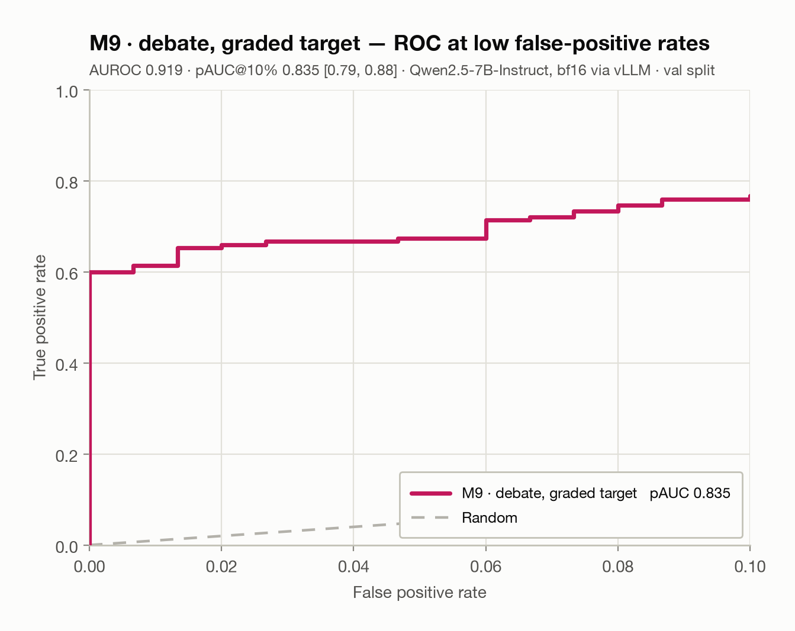

*M9 · debate, graded target: ROC curve for false-positive rates up to 10%.*

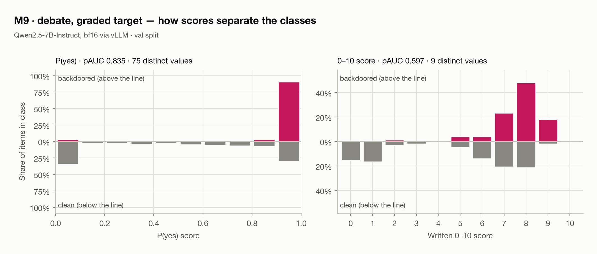

*M9 · debate, graded target: share of backdoored items (above the line) and clean items (below) at each score.*

## How these numbers were made

- **Task.** Each item is an APPS problem with either a validated backdoored solution or a clean one, paired so both come from the same problem. Labels are fixed before any monitor runs.
- **pAUC@10% FPR** is the area under the ROC curve for false-positive rates 0–10%, McClish-standardised so a random monitor scores 0.5 and a perfect one 1.0 — the same convention as the anchor ensemble paper.
- **Catch rate at 1% audit** calibrates a threshold that flags 1% of clean items and reports the share of backdoored items above it. It is a single-shot detection proxy, not deployment-level safety.
- **Ensembles** (M1, M2) average their members' scores without rounding.
- **Intervals** are 95% bootstrap intervals over 10,000 class-stratified resamples; paired comparisons resample the same items for both arms.
- This is a static classification benchmark, not a live control protocol.
